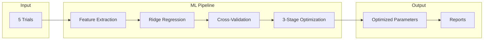

# AquaGuardian: Adaptive Difficulty System

## Overview

>**Goal**: Run 5 trials, perform regression analysis, and tune game parameters to achieve 10% oxygen remaining at the end.

**Process**:

- Player completes 5 trials with different parameters from CSV files (`Trial_5_runs_.csv` or `Trial_Random_Parameters.csv`)
- ML model learns how parameters affect oxygen consumption
- System calculates parameters that should yield 10% oxygen
- Optimized settings used for next session (adaptive difficulty)

**Entry Point:** `TrialRegressionAlgorithm.PerformRegressionAnalysis()`

---

## System Architecture



### Pipeline Flow

**Data Flow:** `TrialSystemManager` → `FeatureExtractor` → `OxygenPredictor` → `DifficultyParameterSolver` → `TrialReportGenerator`

1. **Trial Execution** - `TrialSystemManager` orchestrates 5 trials, `TrialDataService` handles CSV I/O
2. **Feature Extraction** - `FeatureExtractor` converts raw data to 10-feature vectors
3. **Model Training** - `MultipleLinearRegression` with Ridge regularization via `OxygenPredictor`
4. **Validation** - K-Fold cross-validation in `RegressionUtilities`
5. **Optimization** - 3-stage parameter solving in `DifficultyParameterSolver` (see [Optimization Algorithm](#optimization-algorithm))
6. **Reporting** - Analysis summary generation in `TrialReportGenerator`

*(See [Key Components](#key-components) section below for detailed component descriptions)*

## The 10 Features (Game Parameters)

**Direct parameters (9):**

1. **speed** - Forward movement speed
2. **verticalSpeed** - Up/down movement speed
3. **idleUpwardSpeed** - Passive upward drift
4. **lifeTime** - Seconds between oxygen drain cycles
5. **RemoveHealthEveryLifeTime** - Oxygen lost per cycle
6. **removeHealthWithCollide** - Collision damage
7. **timeBetweenCollides** - Collision cooldown
8. **healHealthPoint** - Health pack restoration
9. **factorForce** - Amadeo device force multiplier

**Derived feature (1):**
10. **EffectiveDrainRate** = $$\frac{\text{RemoveHealthEveryLifeTime}}{\text{lifeTime}}$$
    - Actual drain rate per second
    - Cannot be optimized directly (calculated from others)

---

## Input Mode Handling

The system automatically adapts features based on input device:

- **Keyboard Mode** (`IsAmadeoMode = 0`):
  - `factorForce = 0` (no force sensitivity)
  - `idleUpwardSpeed` used as-is

- **Amadeo Mode** (`IsAmadeoMode = 1`):
  - `factorForce` active (force multiplier, range: 0.5-5.0)
  - `idleUpwardSpeed` $\times= 0.5$ (weaker drift for better control)
  - Only marked as Amadeo mode if device was **actually used** during trial (not keyboard fallback)
  - If no Amadeo trials exist, `factorForce` is automatically excluded from optimization

## Quick Start

```csharp
// 1. Load trial data (minimum 3 trials required)
var trials = TrialDataService.LoadTrialDataFromCache();

// 2. Run regression analysis
var result = TrialRegressionAlgorithm.PerformRegressionAnalysis(
    trials, 
    targetOxygen: 10f
);

// 3. View results
Debug.Log(result.summaryText);
Debug.Log($"Error: {result.optimizedSolutionError:F2}%");

// 4. Apply optimized parameters
if (result.optimizedSolution != null) {
    ApplyParameters(result.optimizedSolution);
}
```

## Key Components

The system architecture consists of 13 core components that work together to transform trial data into optimized parameters.

### 1. TrialRegressionAlgorithm.cs

**Location:** `Assets/Scripts/TrialRegressionAlgorithm.cs`

**Main orchestrator** - Entry point that coordinates the entire pipeline.

**Main function:** `PerformRegressionAnalysis(trials, targetOxygen = 10f)` (line 27)

**Flow:**

1. Validates data (min 3 trials required)
2. Trains ML model via `OxygenPredictor.TrainModel()`
3. Performs cross-validation via `RegressionUtilities.PerformCrossValidationAndErrorCalculation()`
4. Prepares features via `RegressionUtilities.PrepareOptimizationFeatures()` (filters banned features)
5. Optimizes parameters via `RegressionUtilities.OptimizeParameters()` (coordinates 3-stage cascade)
6. Generates reports via `TrialReportGenerator`

**Returns:** `RegressionResult` with optimized solution, metrics, and reports

### 2. FeatureExtractor.cs

**Location:** `Assets/Scripts/Linear regression/FeatureExtractor.cs`

**Data translator** - Converts raw trial data into ML-ready features.

**Key functions:**

- `ExtractFeatures(trial)` (line 43) - Extracts 10 features from trial data, handles input mode differences (see [Input Mode Handling](#input-mode-handling))
- `GetPatientBaseline(trials, ranges)` - Provides personalized baseline from player history (uses median values)

### 3. MultipleLinearRegression.cs

**Location:** `Assets/Scripts/Linear regression/MultipleLinearRegression.cs`

**ML engine** - Core regression model with Ridge regularization.

**Key function:** `Fit(X, Y)` (line 64)

- Core ML algorithm: Ridge regression with normalization
- **Model equation:** $$O_2 = \beta_0 + \beta_1 \cdot \text{speed} + \beta_2 \cdot \text{verticalSpeed} + \ldots + \beta_{10} \cdot \text{drainRate}$$
- Prevents overfitting with small datasets via regularization

### 4. OxygenPredictor.cs

**Location:** `Assets/Scripts/Linear regression/OxygenPredictor.cs`

**Model wrapper** - Simplified interface for training and prediction.

**Key methods:**

- `TrainModel(trials)` (line 25) - Trains Ridge regression model with adaptive regularization: $$\lambda = \text{Clamp}(0.5 + (10 - n) \times 0.2, 0.5, 2.0)$$ where $n$ is number of trials
- `PredictOxygen(parameters)` (line 58) - Predicts oxygen % for given parameters (clamped to 0-100%)
- `GetFeatureImportance()` - Returns feature importance ranking for optimization

### 5. DifficultyParameterSolver.cs

**Location:** `Assets/Scripts/Linear regression/DifficultyParameterSolver.cs`

**Optimization engine** - Finds parameters that achieve target oxygen.

**Main functions:** (See [Optimization Algorithm](#optimization-algorithm) section for detailed flow)

- `SolveForTargetOxygen(...)` (line 179) - Primary 3-phase optimizer (typically <1% error)
- `RandomSweepOptimizer(...)` (line 530) - Random search fallback
- `SolveForTargetDifficultyMulti(...)` (line 38) - Conservative gradient fallback

### 6. RegressionUtilities.cs

**Location:** `Assets/Scripts/RegressionUtilities.cs`

**Helper toolkit** - Coordinates optimization cascade and provides utility functions.

**Key functions:** (See [Optimization Algorithm](#optimization-algorithm) section for `OptimizeParameters` details)

- `OptimizeParameters(...)` (line 114) - Coordinates 3-stage optimization cascade (see detailed flow below)
- `PerformCrossValidationAndErrorCalculation(...)` - K-Fold cross-validation (2-5 folds), calculates RMSE, MAE, R²
- `PrepareOptimizationFeatures(...)` - Filters banned features (e.g., excludes `factorForce` if no Amadeo trials, excludes derived features like `EffectiveDrainRate`)

### 7. RegressionMath.cs

**Location:** `Assets/Scripts/Linear regression/RegressionMath.cs`

**Math utilities** - Handles chain rule calculations for derived features.

**Key function:** `EffectiveBeta(...)` - Calculates true coefficient impact including chain rule effects for derived features.

### 8. FeatureNormalizer.cs

**Location:** `Assets/Scripts/Linear regression/FeatureNormalizer.cs`

**Normalization engine** - Standardizes features to mean=0, std=1.

**Key methods:**

- `Fit(X)` - Calculates mean and std from training data
- `Transform(X)` - Normalizes features: $$z = \frac{x - \mu}{\sigma}$$ (ensures all features contribute equally)
- `InverseTransform(Z)` - Denormalizes for optimization (converts back to original parameter space)

### 9. TrialSystemManager.cs

**Location:** `Assets/Scripts/TrialSystemManager.cs`

**Trial lifecycle manager** - Orchestrates execution of 5 trials.

**Key methods:**

- `StartTrials()` (line 53) - Initializes trial mode, loads parameters from CSV, manages lifecycle
- `ContinueToNextTrial()` (line 83) - Advances to next trial after completion
- `OnTrialFishReached(finalOxygen, completed)` (line 98) - Handles trial completion, saves results to CSV and cache

### 10. TrialDataService.cs

**Location:** `Assets/Scripts/Trial/TrialDataService.cs`

**CSV operations** - Centralized file I/O for trial data.

**Key functions:**

- `LoadTrialDataFromCache()` (line 98) - Loads all completed trials from CSV
- `LoadTrialParameters(trialId)` (line 33) - Loads parameters for current trial
- `SaveTrialResult(trialData)` (line 249) - Saves oxygen results to CSV

**CSV Files:** `Assets/Data/Trials/Trial_5_runs_.csv` or `Trial_Random_Parameters.csv`

### 11. TrialDataCache.cs

**Location:** `Assets/Scripts/TrialDataCache.cs`

**Data caching** - Stores oxygen values across multiple runs.

**Key methods:**

- `AppendTrial(trialId, oxygen)` (line 58) - Caches trial result
- `GetLatestRunOxygenValues()` (line 100) - Returns last 5 trials for regression

### 12. TrialReportGenerator.cs

**Location:** `Assets/Scripts/TrialReportGenerator.cs`

**Report generation** - Creates analysis reports.

**Generates:**

- **Summary report** - Short overview (5-8 lines) with optimized parameters
- **Full report** - Detailed analysis with coefficients, CV metrics, feature importance

### 13. TrialDataModels.cs

**Location:** `Assets/Scripts/TrialDataModels.cs`

**Data structures** - Defines core data models.

**Key Classes:**

- `TrialData` - Single trial data (parameters + oxygen result)
- `RegressionResult` - Analysis results (optimized params + metrics)
- `ParameterRanges` - Min/max bounds for each parameter

---

## Optimization Algorithm

### How It Finds Optimal Parameters

**Goal:** Find parameters that give exactly 10% oxygen

**Location:** `Assets/Scripts/RegressionUtilities.cs` → `OptimizeParameters()` (line 114) coordinates the cascade

---

### Stage 1: SolveForTargetOxygen() (Primary - most accurate)

**Location:** `Assets/Scripts/Linear regression/DifficultyParameterSolver.cs` (line 179)

**Called by:** `RegressionUtilities.OptimizeParameters()` (line 122)

**Flow:**

1. Prepares baseline parameters (personalized from player history)
2. Filters free features (excludes derived features like `EffectiveDrainRate`)
3. Executes 3-phase optimization

#### Phase 1 - Analytical Solution

**Location:** `SolveMinimalChange()` - called at line 213, defined at line 246

- Starts from player's baseline (personalized via `FeatureExtractor.GetPatientBaseline()`)
- Calculates what non-optimized features contribute (fixed contribution)
- Scales free features proportionally to their coefficients
- **Formula:** $$\Delta x = \frac{(O_{\text{target}} - O_{\text{fixed}}) \cdot \beta}{||\beta||^2}$$
- Uses `RegressionMath.EffectiveBeta()` for chain rule on derived features
- Instant, optimal solution (minimal parameter changes)

#### Phase 2 - Gradient Refinement

**Location:** `RefineProjectedGradient()` - called at line 222, defined at line 314

- Fine-tunes solution with projected gradient descent
- Moves parameters in gradient direction to reduce error
- Adjusts for parameter boundaries (clamps to valid ranges)
- **Adaptive learning rate:** Based on initial error distance:
  - Error > 40%: LR = 0.7, max steps = 250
  - Error > 20%: LR = 0.5, max steps = 150
  - Error > 10%: LR = 0.3, max steps = 100
  - Error ≤ 10%: LR = 0.2, max steps = 50
- **Tolerance:** 0.1% error threshold
- Usually achieves < 0.5% error

#### Phase 3 - Iterative Polish (if error > 0.5%)

**Location:** `RefineProjectedGradientIterative()` - called at line 230, defined at line 369

- Extended refinement with best-solution tracking
- Keeps track of best error across iterations (returns best, not last)
- **Adaptive iterations:** Based on current error:
  - Error > 40%: 400 iterations
  - Error > 20%: 300 iterations
  - Error > 10%: 200 iterations
  - Error ≤ 10%: 150 iterations
- Achieves < 0.1% error in most cases

---

### Stage 2: RandomSweepOptimizer() (Fallback if error > 5%)

**Location:** `Assets/Scripts/Linear regression/DifficultyParameterSolver.cs` (line 530)

**Called by:** `RegressionUtilities.OptimizeParameters()` (line 129) if `SolveForTargetOxygen()` fails or error > 5%

**How it works:**

- Generates 150 random parameter combinations (default `samples = 150`)
- Samples from valid parameter ranges for each feature
- Predicts oxygen for each combination using the trained model
- Returns the candidate with smallest error
- More robust to noisy data or when target is far from baseline

**Note:** Only tries this if primary method fails or error exceeds threshold

---

### Stage 3: SolveForTargetDifficultyMulti() (Final fallback)

**Location:** `Assets/Scripts/Linear regression/DifficultyParameterSolver.cs` (line 38)

**Called by:** `RegressionUtilities.OptimizeParameters()` (line 142) if both previous methods fail or error > 5%

**How it works:**

- Conservative gradient descent on top K features (default: top 3)
- Updates features iteratively by moving in gradient direction (coefficient)
- Uses lower learning rates for stability
- **Guaranteed to return solution** (even if not optimal)
- Used as last resort when other methods fail

**Parameters:**

- `maxFeaturesToOptimize = 3` (optimizes only top 3 most important features)
- Adaptive learning rate based on error magnitude
