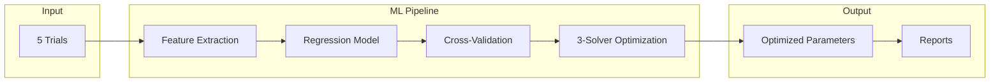
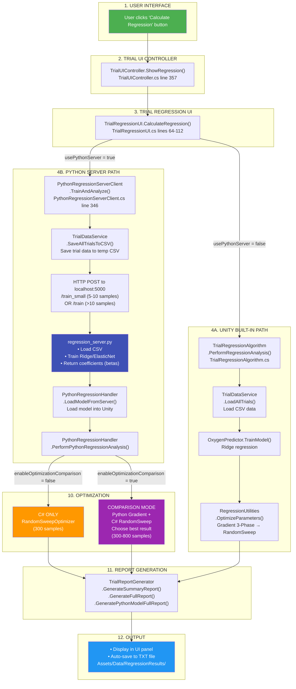
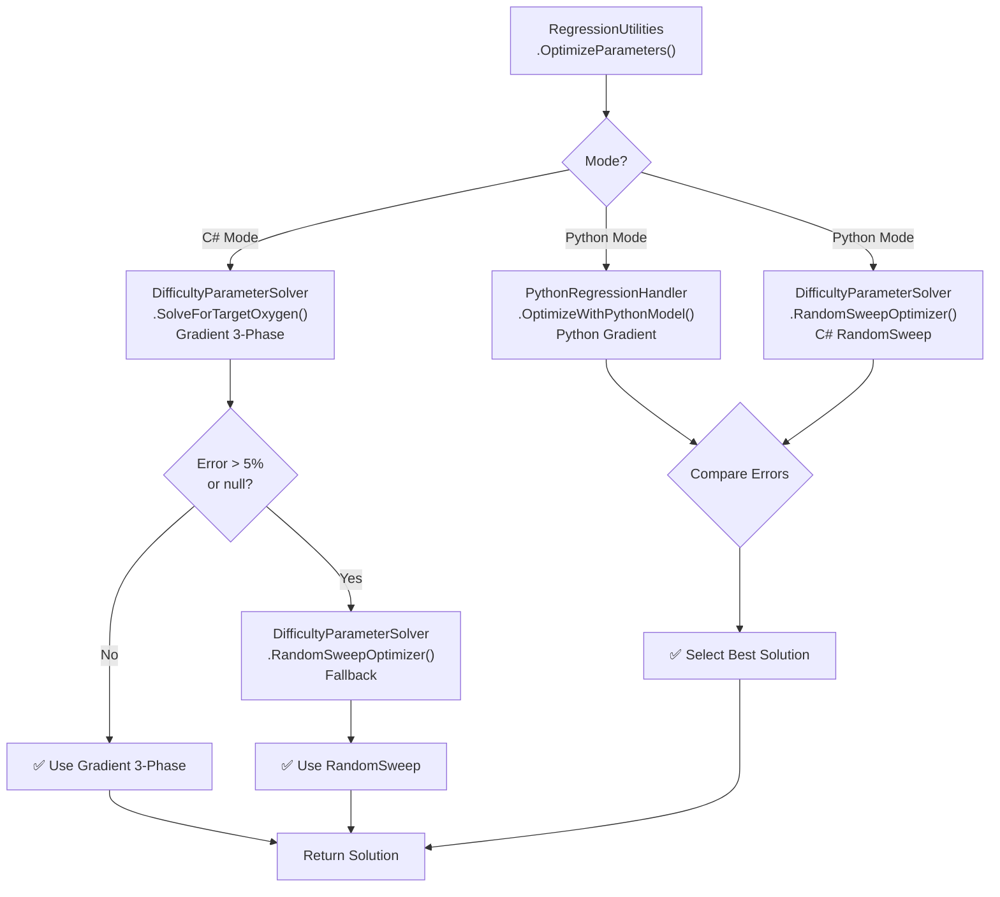

# AquaGuardian: Adaptive Difficulty System

## Overview

**AquaGuardian** is a rehabilitation game system that uses machine learning to adaptively adjust game difficulty based on patient performance. The system analyzes player trial data and automatically optimizes game parameters to achieve target performance levels (e.g., 10\% oxygen remaining at trial end).

>**Goal**: Run 5 trials, perform regression analysis, and tune game parameters to achieve 10% oxygen remaining at the end.

**Process**:

- Player completes 5 trials with different parameters from CSV files (`Trial_5_runs_.csv` or `Trial_Random_Parameters.csv`)
- ML model learns how parameters affect oxygen consumption
- System calculates parameters that should yield 10% oxygen
- Optimized settings used for next session (adaptive difficulty)

**Entry Point:** `TrialRegressionAlgorithm.PerformRegressionAnalysis()`

---

## System Architecture



### Pipeline Flow

**Data Flow:** `TrialSystemManager`, `FeatureExtractor`, `OxygenPredictor`, `DifficultyParameterSolver`, `TrialReportGenerator`

1. **Trial Execution** - `TrialSystemManager` orchestrates 5 trials, `TrialDataService` handles CSV I/O
2. **Feature Extraction** - `FeatureExtractor` converts raw data to feature vectors (C#: 10 features, Python: 9 features)
3. **Model Training** - Regression model (C# mode: `MultipleLinearRegression` with Ridge | Python mode: ElasticNet/Huber/PLS via HTTP server)
4. **Validation** - K-Fold cross-validation in `RegressionUtilities`
5. **Optimization** - 3-solver parameter optimization in `DifficultyParameterSolver` (see [Optimization Algorithm](#optimization-algorithm))
6. **Reporting** - Analysis summary generation in `TrialReportGenerator`

*(See [Key Components](#key-components) section below for detailed component descriptions)*

---

## Workflow: Complete System Flow

### Workflow Overview

The regression system follows a clear pipeline from user interaction to final report generation. Understanding this flow is crucial for debugging, extending, or modifying the system.

### Key Decision Points

1. **Mode Selection**: Unity (C#) vs Python Server
   - Determined by `TrialRegressionUI.usePythonServer` flag
   - Python mode requires `PythonRegressionServerClient` in scene and server running

2. **Optimization Strategy**: Sequential (C#) vs Parallel (Python)
   - C# Mode: Tries Gradient 3-Phase first, falls back to RandomSweep if error > 5%
   - Python Mode: Runs both Python Gradient and RandomSweep in parallel, selects best

3. **Baseline Calculation**: Patient history vs defaults
   - If ≥ 3 trials: uses median of patient history
   - If < 3 trials: uses mid-range defaults

---

## Code Flow Diagrams

### Complete System Flow



**Flow Explanation:**

1. **User Interface**: User clicks the "Calculate Regression" button
2. **Trial UI Controller**: Routes to regression panel via `TrialUIController.ShowRegression()`
3. **Trial Regression UI**: Main entry point `TrialRegressionUI.CalculateRegression()`, checks Python server flag
4. **Path Selection**:
   - **Unity Path (4A)**: Uses built-in Ridge regression, trains locally, optimizes with Gradient 3-Phase to RandomSweep fallback
   - **Python Path (4B)**: Sends data to Python server via HTTP, receives trained model, loads into Unity
5. **Optimization**:
   - Unity path: Gradient 3-Phase (primary) to RandomSweep (fallback if error > 5%)
   - Python path: Comparison mode (both Python Gradient and C# RandomSweep) or C# only
6. **Report Generation**: Creates summary and full reports with optimization results
7. **Output**: Displays in UI panel and auto-saves to `Assets/Data/RegressionResults/`

**Key Decision Points:**

- **`usePythonServer`**: Determines Unity vs Python path (set in `TrialRegressionUI` Inspector)
- **`enableOptimizationComparison`**: Controls whether to compare Python Gradient vs C# RandomSweep (set in `PythonRegressionHandler`)
- **Error thresholds**: Gradient 3-Phase falls back to RandomSweep if error > 5% or solution is null

---

### 3-Solver Optimization Cascade

**Note:** These are THREE DIFFERENT SOLVERS (not phases). `SolveForTargetOxygen` contains 3 internal phases, but this diagram shows the fallback chain between different solvers.

```mermaid
flowchart LR
    subgraph Solver1["Solver 1: SolveForTargetOxygen<br/>(Contains 3 internal phases)"]
        direction LR
        P1A["Phase 1: Analytical Solution<br/><i>Minimal parameter changes</i>"]
        P1B["Phase 2: Gradient Refinement<br/><i>Fine-tune solution</i>"]
        P1C["Phase 3: Extended Refinement<br/><i>If error > 0.5%</i>"]
        P1A --> P1B --> P1C
    end
    
    subgraph Solver2["Solver 2: RandomSweepOptimizer<br/>(Fallback solver)"]
        direction LR
        P2A["Generate 300 random<br/>parameter combinations"]
        P2B["Predict oxygen<br/>for each"]
        P2C["Select lowest error"]
        P2A --> P2B --> P2C
    end
    
    subgraph Solver3["Solver 3: SolveForTargetDifficultyMulti<br/>(Last resort fallback)"]
        direction LR
        P3A["Gradient descent"]
        P3B["Update top K features"]
        P3C["Iterate until<br/>convergence"]
        P3A --> P3B --> P3C
    end
    
    P1C -->|"Error > 5%<br/>or null"| P2A
    P2C -->|"Error > 5%<br/>or null"| P3A
    
    style Solver1 fill:#4CAF50,color:#fff
    style Solver2 fill:#FF9800,color:#fff
    style Solver3 fill:#F44336,color:#fff
```



**Optimization Strategy:**

- **Solver 1 (Green)**: `SolveForTargetOxygen` - Primary solver with 3 internal phases (analytical solution, gradient refinement, extended refinement). Fast and accurate for dense coefficients.
- **Solver 2 (Orange)**: `RandomSweepOptimizer` - Fallback solver using random search. Robust when Solver 1 fails.
- **Solver 3 (Red)**: `SolveForTargetDifficultyMulti` - Last resort fallback using multi-gradient descent. Used when both previous solvers fail.

**Transition Conditions:**

- Solver 1 to Solver 2: If error > 5% or solution is null or error is NaN
- Solver 2 to Solver 3: If solution is null or error is NaN (not based on error threshold)

---

### Optimization Strategy Comparison



**Key Differences:**

- **C# Mode (Sequential)**: Tries Gradient 3-Phase first (fast, accurate for dense coefficients), only uses RandomSweep if needed
- **Python Mode (Parallel)**: Runs both optimizers simultaneously, compares results, selects best (more robust for sparse coefficients)

---

## Component Call Hierarchy

### C# Mode Call Chain

```text
TrialRegressionUI.CalculateRegression()
  calls
TrialDataService.LoadAllTrials()
  calls
TrialRegressionAlgorithm.PerformRegressionAnalysis()
  calls
TrialRegressionAlgorithm.PerformUnityRegressionAnalysis()
  calls RegressionUtilities.CalculateTrialStatistics()
  calls OxygenPredictor.TrainModel()
        calls FeatureExtractor.ExtractFeaturesAndTargets()
        calls MultipleLinearRegression.Train()
  calls RegressionUtilities.PerformCrossValidationAndErrorCalculation()
  calls RegressionUtilities.PrepareOptimizationFeatures()
  calls RegressionUtilities.OptimizeParameters()
        calls RegressionUtilities.BuildOptimizationIndices()
        calls RegressionUtilities.PrepareOptimizationBaseline()
              calls FeatureExtractor.GetPatientBaseline()
              calls RegressionUtilities.ConstrainRangesToObserved()
        calls DifficultyParameterSolver.SolveForTargetOxygen() [PRIMARY]
              calls DifficultyParameterSolver.SolveMinimalChange() [Phase 1]
              calls DifficultyParameterSolver.RefineProjectedGradient() [Phase 2]
              calls DifficultyParameterSolver.RefineProjectedGradientIterative() [Phase 3]
        calls DifficultyParameterSolver.RandomSweepOptimizer() [FALLBACK if error > 5% or null/NaN]
        calls DifficultyParameterSolver.SolveForTargetDifficultyMulti() [LAST RESORT if solution is null or error is NaN]
  calls TrialReportGenerator.GenerateSummaryReport()
  calls TrialReportGenerator.GenerateFullReport()
  calls
TrialRegressionAlgorithm.SaveRegressionResultsToFile()
```

### Python Mode Call Chain

```text
TrialRegressionUI.CalculateRegression()
  calls
PythonRegressionServerClient.TrainAndAnalyze() [Coroutine]
  calls PythonRegressionServerClient.SaveAllTrialsToCSV()
  calls HTTP POST to localhost:5000/train
  calls PythonRegressionServerClient.LoadModelFromResponse()
  calls PythonRegressionHandler.PerformPythonRegressionAnalysis()
        calls RegressionUtilities.CalculateTrialStatistics()
        calls PythonRegressionHandler.OptimizeWithPythonModel() [Python Gradient]
        calls DifficultyParameterSolver.RandomSweepOptimizer() [C# RandomSweep]
        calls TrialReportGenerator.GeneratePythonModelFullReport()
  calls
TrialRegressionAlgorithm.SaveRegressionResultsToFile()
```

---

## Important Details to Know

### 1. Data Loading

- **Source**: CSV files in `Assets/Data/Trials/`
- **Files**: `Trial_5_runs_.csv` (fixed parameters) or `Trial_Random_Parameters.csv` (random mode)
- **Minimum**: 3 trials required for analysis (validated in `TrialRegressionAlgorithm.PerformRegressionAnalysis`)
- **Function**: `TrialDataService.LoadAllTrials(bool useRandomParameters)`

### 2. Feature Extraction

- **C# Mode**: 10 features (includes `EffectiveDrainRate` derived feature)
- **Python Mode**: 9 features (excludes `EffectiveDrainRate` to prevent multicollinearity)
- **Adjustments**:
  - Amadeo mode: `idleUpwardSpeed *= 0.5`, `factorForce` active
  - Keyboard mode: `factorForce = 0`
- **Function**: `FeatureExtractor.ExtractFeatures(TrialData)`

### 3. Model Training

- **C# Mode**: Ridge regression with adaptive regularization $$\lambda = \text{Clamp}(0.5 + (10 - n) \times 0.2, 0.5, 2.0)$$
- **Python Mode**: ElasticNet/Ridge/Huber/PLS (configurable via server)
- **Function**: `OxygenPredictor.TrainModel()` or Python server `/train` endpoint

### 4. Optimization

- **Baseline**: Personalized from patient history (median if ≥ 3 trials, mid-range if < 3)
- **Ranges**: Constrained to observed data with adaptive buffer (prevents unrealistic parameters)
- **3 Solvers**: The system uses 3 different solvers in cascade:
  - **Solver 1**: `SolveForTargetOxygen` (contains 3 internal phases: Analytical → Gradient → Iterative)
  - **Solver 2**: `RandomSweepOptimizer` (fallback if Solver 1 fails)
  - **Solver 3**: `SolveForTargetDifficultyMulti` (last resort fallback)
- **Primary Method**: Solver 1 (Gradient 3-Phase) for C# mode, or Python Gradient for Python mode
- **Fallback**: Solver 2 (RandomSweep) - always works, doesn't depend on coefficients
- **Function**: `RegressionUtilities.OptimizeParameters()`

### 5. Report Generation

- **Summary**: Brief metrics (R², RMSE, MAE, optimized parameters)
- **Full Report**: Detailed analysis including feature importance, optimization comparison (Python mode)
- **Auto-save**: Enabled by default, saved to `Assets/Data/RegressionResults/`
- **Function**: `TrialReportGenerator.GenerateSummaryReport()` / `GenerateFullReport()`

---

## Component Reference

| Step | Component | File | Key Function | Called From |
|------|-----------|------|--------------|-------------|
| 1 | UI Entry | `TrialUIController.cs` / `TrialRegressionUI.cs` | `ShowRegression()` :357 / `CalculateRegression()` :64 | Button onClick |
| 2 | Data Load | `TrialDataService.cs` | `LoadAllTrials()` :98 | TrialRegressionUI |
| 3 | Orchestrator | `TrialRegressionAlgorithm.cs` | `PerformRegressionAnalysis()` :26 | TrialRegressionUI |
| 4 | Statistics | `RegressionUtilities.cs` | `CalculateTrialStatistics()` :21 | TrialRegressionAlgorithm |
| 5 | Training | `OxygenPredictor.cs` | `TrainModel()` :25 | TrialRegressionAlgorithm |
| 6 | Features | `FeatureExtractor.cs` | `ExtractFeaturesAndTargets()` :126 / `ExtractFeatures()` :27 | OxygenPredictor, RegressionUtilities |
| 7 | CV | `RegressionUtilities.cs` | `PerformCrossValidationAndErrorCalculation()` :38 | TrialRegressionAlgorithm |
| 8 | Optimization | `RegressionUtilities.cs` | `OptimizeParameters()` :147 | TrialRegressionAlgorithm |
| 9 | Gradient 3-Phase | `DifficultyParameterSolver.cs` | `SolveForTargetOxygen()` :179 | RegressionUtilities |
| 10 | RandomSweep | `DifficultyParameterSolver.cs` | `RandomSweepOptimizer()` :530 | RegressionUtilities |
| 11 | Reporting | `TrialReportGenerator.cs` | `GenerateFullReport()` | TrialRegressionAlgorithm |
| 12 | Save | `TrialRegressionAlgorithm.cs` | `SaveRegressionResultsToFile()` :42 | TrialRegressionUI |
| 13 | Export | `Assets/Data/RegressionResults/` | `UnityRegression_*.txt` | Auto-saved |

---

## Features (C# vs Python)

**C# uses 10 features**, **Python uses 9 features** (excludes `EffectiveDrainRate` to prevent multicollinearity).

### 9 Base Features (Both C# and Python)

1. **speed** - Forward movement speed
2. **verticalSpeed** - Up/down movement speed
3. **idleUpwardSpeed** - Passive upward drift
4. **lifeTime** - Seconds between oxygen drain cycles
5. **RemoveHealthEveryLifeTime** - Oxygen lost per cycle
6. **removeHealthWithCollide** - Collision damage
7. **timeBetweenCollides** - Collision cooldown
8. **healHealthPoint** - Health pack restoration
9. **factorForce** - Amadeo device force multiplier

### 10th Feature (C# Only)

1. **EffectiveDrainRate** = $$\frac{\text{RemoveHealthEveryLifeTime}}{\text{lifeTime}}$$
    - Actual drain rate per second
    - Cannot be optimized directly (calculated from others)
    - **C#:** Included in regression, banned from optimization
    - **Python:** Excluded entirely (multicollinearity with source features)

---

## Input Mode Handling

The system automatically adapts features based on input device:

- **Keyboard Mode** (`IsAmadeoMode = 0`):
  - `factorForce = 0` (no force sensitivity)
  - `idleUpwardSpeed` used as-is

- **Amadeo Mode** (`IsAmadeoMode = 1`):
  - `factorForce` active (force multiplier, range: 0.5-5.0)
  - `idleUpwardSpeed ×= 0.5` (weaker drift for better control)
  - Only marked as Amadeo mode if device was **actually used** during trial (not keyboard fallback)
  - If no Amadeo trials exist, `factorForce` is automatically excluded from optimization

## Regression Modes

The system supports **two regression modes**:

### Mode 1: C# Built-in Regression (Default)

- Pure C# implementation (no external dependencies)
- Uses Ridge regression with adaptive regularization
- Fast and integrated directly into Unity
- **No setup required** - works out of the box

### Mode 2: Python Regression Server (Advanced)

- External Python server with advanced ML models
- Supports ElasticNet, Ridge, Huber, PLS algorithms
- Better for complex optimization scenarios
- Requires Python 3.9+

**Python Dependencies** (`requirements.txt`):

```txt
# Core ML dependencies
numpy>=1.21.0
pandas>=1.3.0
scikit-learn>=1.0.0

# Server dependencies (optional - only for server mode)
flask>=2.0.0
flask-cors>=3.0.0
```

**Installation:**

```bash
pip install -r requirements.txt
```

**Usage:**

**Real-time Server** (Unity connects via HTTP)

```bash
python PythonScripts/regression_server.py
# Server runs on localhost:5000
```

**Unity Setup:**

1. Enable the **"python model"** GameObject in the scene
2. In **RegressionAnalyzer** component, check ✅ **"Auto Load Python"**

**How it works:**

- Unity sends trial data via HTTP POST to `/train`, receives coefficients
- Unity uses the Python model for predictions and optimization
- Optimization algorithms still run in Unity (C# side)

**For offline model training, see PythonScripts/train_regression_model.py**

## Quick Start

### Basic Usage (C# Mode)

```csharp
// 1. Load trial data (minimum 3 trials required)
var trials = TrialDataService.LoadAllTrials(useRandomParameters: false);

// 2. Run regression analysis
var result = TrialRegressionAlgorithm.PerformRegressionAnalysis(
    trials, 
    targetOxygen: 10f
);

// 3. View results
Debug.Log(result.summaryText);
Debug.Log($"Error: {result.optimizedSolutionError:F2}%");

// 4. Apply optimized parameters
if (result.optimizedSolution != null) {
    ApplyParameters(result.optimizedSolution);
}
```

### Using the UI

1. Complete 5 trials in the game
2. Click **"Calculate Regression"** button in the UI
3. System automatically:
   - Loads trial data from CSV
   - Trains regression model
   - Optimizes parameters for target oxygen (10%)
   - Generates detailed report
4. Review results in the regression panel
5. Reports are auto-saved to `Assets/Data/RegressionResults/UnityRegression_*.txt`

### Output Files

- **Regression Reports**: `Assets/Data/RegressionResults/UnityRegression_YYYY-MM-DD_HH-MM-SS.txt`
  - Contains model metrics (R², RMSE, MAE)
  - Shows optimized parameters
  - Includes feature importance analysis
  - Comparison between optimization methods (if Python mode enabled)

- **Trial Data CSV**: `Assets/Data/Trials/Trial_5_runs_.csv` or `Trial_Random_Parameters.csv`
  - Stores all trial parameters and outcomes
  - Used for model training

## Key Components

> For Python mode, components 3-8 are replaced by external Python server. See [Regression Modes](#regression-modes) section above for setup instructions.

| # | Component | Location | Role |
|---|-----------|----------|------|
| 1 | `TrialRegressionAlgorithm` | `Assets/Scripts/` | Main orchestrator, entry point |
| 2 | `FeatureExtractor` | `Assets/Scripts/Regression/Features/` | Converts trial data to feature vectors |
| 3 | `MultipleLinearRegression` | `Assets/Scripts/Linear regression/` | Ridge regression with L2 regularization |
| 4 | `OxygenPredictor` | `Assets/Scripts/Linear regression/` | Training/prediction interface |
| 5 | `DifficultyParameterSolver` | `Assets/Scripts/Linear regression/` | Optimization algorithms |
| 6 | `RegressionUtilities` | `Assets/Scripts/` | Cross-validation, optimization coordination |
| 7 | `RegressionMath` | `Assets/Scripts/Linear regression/` | Chain rule for derived features |
| 8 | `FeatureNormalizer` | `Assets/Scripts/Linear regression/` | Z-score normalization |
| 9 | `TrialSystemManager` | `Assets/Scripts/` | Trial lifecycle (5 trials) |
| 10 | `TrialDataService` | `Assets/Scripts/Trial/` | CSV I/O operations |
| 11 | `TrialDataCache` | `Assets/Scripts/` | Runtime data caching |
| 12 | `TrialReportGenerator` | `Assets/Scripts/` | Summary + full report generation |
| 13 | `TrialDataModels` | `Assets/Scripts/` | Data structures (`TrialData`, `RegressionResult`) |

### Key Equations

**Ridge Regression:** $$\hat{\beta} = (X^TX + \lambda I)^{-1}X^Ty$$

**Adaptive Regularization:** $$\lambda = \text{Clamp}(0.5 + (10 - n) \times 0.2,\ 0.5,\ 2.0)$$

**Normalization:** $$z = \frac{x - \mu}{\sigma}$$

**Prediction:** $$O_2 = \beta_0 + \sum_{i=1}^{10} \beta_i \cdot x_i$$

---

## How It Works

### Step-by-Step Execution

1. **Data Collection**: Player completes 5 trials with varying parameters
2. **Feature Extraction**: Raw trial data converted to 10 feature vectors (C#) or 9 (Python)
3. **Model Training**: Ridge regression (C#) or ElasticNet/Huber/PLS (Python) learns parameter to oxygen relationship
4. **Cross-Validation**: K-fold CV evaluates model quality (if >= 10 trials)
5. **Optimization**: System finds parameter combination that predicts 10\% oxygen
6. **Reporting**: Detailed analysis generated with metrics and optimized parameters

### Optimization Strategy

The system uses a **dual optimization approach**:

- **C# Mode**: Sequential - tries Gradient 3-Phase first, falls back to RandomSweep if error > 5%
- **Python Mode**: Parallel - runs both Python Gradient and RandomSweep, selects best result

This ensures robust optimization across different scenarios (dense vs sparse coefficients, small vs large datasets).

### Baseline Personalization

Before optimization, the system calculates a **personalized baseline** from patient history:

- If patient has ≥ 3 trials: uses **median** of historical parameters (robust to outliers)
- If patient has < 3 trials: uses **mid-range** defaults from parameter ranges
- Adds 1% random noise to baseline for result variability

This ensures optimization starts from patient-specific ranges rather than generic defaults.

---

## Optimization Algorithm

**Goal:** Find parameters where predicted oxygen = 10%

### Optimization Methods by Mode

| Mode | Primary Method | Fallback | Strategy |
|------|----------------|----------|----------|
| **C# (Unity)** | Gradient 3-Phase | RandomSweep (if error > 5\% or null/NaN) -> SolveForTargetDifficultyMulti (if null/NaN) | Sequential |
| **Python** | Python Gradient + RandomSweep | Baseline Fallback (if both fail) | Parallel (best wins) |

---

### Method 1A: Solver 1 - SolveForTargetOxygen (Gradient 3-Phase)

**Note:** This is **Solver 1** of the 3-solver cascade. It contains **3 internal phases** that progressively refine the solution.

**Best for:** Dense coefficients (all features have non-zero weights)

**3 internal phases:**

| Phase | Function | What it does |
|-------|----------|--------------|
| 1 | `SolveMinimalChange()` | Analytical solution |
| 2 | `RefineProjectedGradient()` | Gradient descent with adaptive LR |
| 3 | `RefineProjectedGradientIterative()` | Extended polish, tracks best solution |

**Typical error:** < 0.5%

---

### Method 1B: Python Gradient (Python Mode)

**Best for:** Sparse coefficients (many features = 0 from ElasticNet/Lasso)

Simple gradient descent optimized for sparse models:

- Checks if enough non-zero coefficients exist (>= 2)
- Returns `null` if too sparse, then fallback to RandomSweep
- Smaller learning rates (0.02-0.1) for stability
- Early stopping if error increases

**Why not use Gradient 3-Phase for Python?**

```text
Python coefficients example:
  speed: 0.0000          ← zero!
  verticalSpeed: 0.0000  ← zero!
  collisionDamage: -6.67 ← non-zero
  healHealth: 5.14       ← non-zero
  drainRate: -7.29       ← non-zero
```

With 6/9 coefficients = 0, Gradient 3-Phase can't compute direction properly.

---

### Method 2: Solver 2 - RandomSweepOptimizer (Both Modes)

**Note:** This is **Solver 2** of the 3-solver cascade. Used as fallback when Solver 1 fails.

**Best for:** Any situation - doesn't depend on coefficients

Monte Carlo random search:

- **C# Mode**: Generates 300 random parameter combinations (fixed)
- **Python Mode**: Generates 300-800 random parameter combinations (adaptive: 300 if error ≤ 5%, 500 if error ≤ 10%, 800 if error > 10%)
- Evaluates each with the prediction model
- Returns the combination with lowest error
- Dynamic seed for result variability

**Typical error:** < 2%

**Why it always works:**

- Doesn't use coefficients for direction
- Just samples and picks the best
- Robust to noise and edge cases

---

### Method 3: Solver 3 - SolveForTargetDifficultyMulti (Last Resort)

**Note:** This is **Solver 3** of the 3-solver cascade. Used as last resort fallback when both Solver 1 and Solver 2 fail.

**Best for:** Edge cases where both previous solvers fail

Multi-gradient descent optimizer:

- Updates top-K most important features
- Uses gradient descent with adaptive learning rate
- Iterates until convergence or max iterations
- Returns optimized parameters or null if still fails

**When used:** Only when both Solver 1 (error > 5% or null/NaN) and Solver 2 (null or NaN) fail

---

### Selection Logic

**C# Mode (Sequential - 3 Solver Cascade):**

```text
Solver 1: SolveForTargetOxygen (3 internal phases)
  then
If error > 5% or null or NaN: try Solver 2 (RandomSweep, 300 samples)
  then
If solution is null or error is NaN: try Solver 3 (SolveForTargetDifficultyMulti)
  then
Use whichever succeeds first
```

**Python Mode (Parallel):**

```text
Run Python Gradient AND RandomSweep in parallel
  (RandomSweep uses 300-800 samples based on Python Gradient error)
  then
Compare errors
  then
Select the one with lowest error
  then
If both fail: use Baseline Fallback
  then
Report shows: [Selected: method_name]
```
# Screenshots


