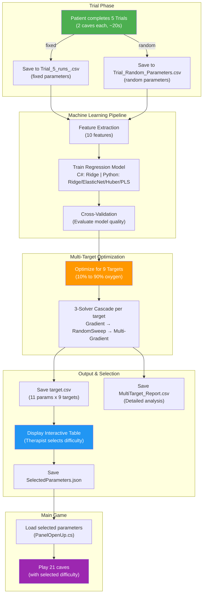
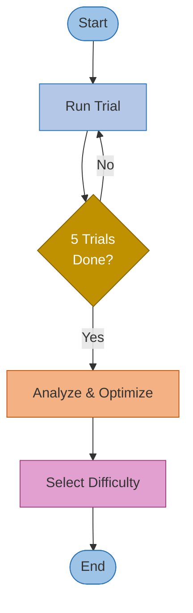
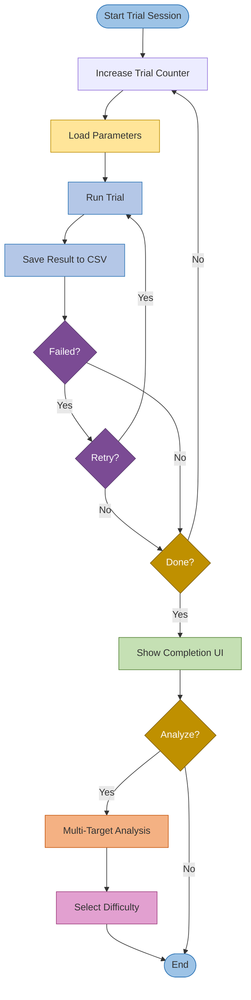
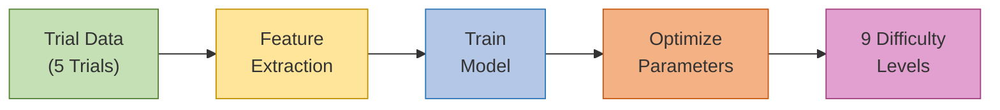
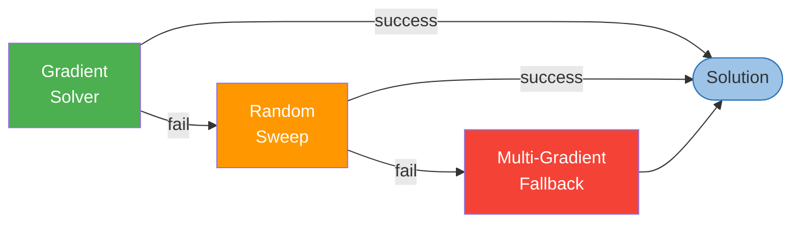
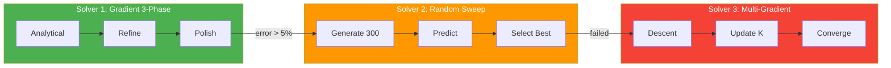

# AquaGuardian: Adaptive Difficulty System

## Table of Contents

**Part I: System Overview**

- [Overview](#overview)
- [System Capabilities](#system-capabilities)

**Part II: Architecture & Data Flow**

- [Key Files & Data Flow](#key-files--data-flow)
- [System Architecture](#system-architecture)
- [Trial Session Flow](#trial-session-flow)
- [Pipeline Flow](#pipeline-flow)
- [Important Runtime Behaviors](#important-runtime-behaviors)

**Part III: ML & Optimization**

- [Features (10 Features)](#features-10-features--synchronized-c-and-python)
- [Regression Modes](#regression-modes)
- [Regression Model Details](#regression-model-details)
- [Optimization Algorithm Details](#optimization-algorithm-details)
- [Parameter Ranges & Constraints](#parameter-ranges--constraints)

**Part IV: Implementation Details**

- [Key Components](#key-components)
- [Input Mode Handling](#input-mode-handling)
- [Quick Start](#quick-start)

**Part V: Usage & Configuration**

- [Multi-Target User Workflow](#multi-target-user-workflow)
- [Configuration & Settings](#configuration--settings)
- [Debug & Logging](#debug--logging)

---

## Part I: System Overview

### Overview

This version extends the AquaGuardian rehabilitation game, developed in collaboration with Beit Loewenstein Rehabilitation Center for post-stroke finger motor recovery using the Amadeo robotic device. The game enables patients to control an underwater diver navigating caves while collecting oxygen balloons and avoiding obstacles. This version focuses on creating a **dynamic difficulty calculation algorithm** to adapt game parameters to individual patients.

**How It Works:**

The patient completes **5 trial runs** (each trial: 2 caves, ~20 seconds). The system learns a patient-specific **multiple linear regression model** over engineered features extracted from gameplay trials, and then uses a hierarchy of optimization algorithms to generate parameter sets that achieve prescribed target oxygen levels.

**Evolution from Single-Target to Multi-Target:**

Initially, we attempted to model for a **single target of 10% oxygen**. However, we realized this approach was insufficient due to the mismatch between trial scope (short 20-second evaluations) and full game scope (21 caves, significantly longer). 

To address this fundamental limitation, the system evolved to generate a **complete difficulty spectrum from 10% to 90% oxygen targets** in a single analysis. This empowers therapists to select the appropriate difficulty level for each patient based on their specific rehabilitation needs. The system now:

1. Analyzes trial performance once (5 trials)
2. Generates a **complete difficulty spectrum** (10%-90% oxygen targets)
3. Presents an **interactive lookup table** of optimized parameters
4. Allows patients/therapists to **select the appropriate challenge level** for the full game (21 caves)

This approach provides **adaptive difficulty selection** without requiring multiple optimization runs, making the system more practical and patient-centered.

>**Goal**: Run 5 trials, perform regression analysis, and generate optimized parameters for 9 difficulty levels (10%-90% oxygen targets).

**Main Entry Point:**

- `MultiTargetOptimizer.RunMultiTargetAnalysis()` - Primary workflow for generating 10%-90% difficulty spectrum
- `TrialRegressionAlgorithm.PerformRegressionAnalysis()` - Legacy single-target optimization (used in earlier versions)

---

### System Capabilities

1. **Trial-Based Calibration**: Five short calibration trials (2 caves each, ~2 minutes total) establish baseline performance
2. **Patient-Specific ML**: Personalized Ridge regression models over 10 features (9 measured + derived `EffectiveDrainRate`)
3. **Three-Solver Optimization**: Hierarchical cascade (Gradient 3-Phase → RandomSweep → Multi-Gradient) ensures robust solutions
4. **Multi-Target Difficulty**: Generate 9 difficulty levels (10%-90% oxygen) in single analysis
5. **Therapist Selection Interface**: Interactive lookup table for selecting appropriate challenge level
6. **Automatic Persistence**: Selected parameters saved to `SelectedParameters.json` and auto-loaded into main game (21 caves)
7. **Optional Python Integration**: Support advanced ML models (ElasticNet, Huber, PLS) via external server

---

## Part II: Architecture & Data Flow

### Key Files & Data Flow

### Trial Data Files

#### **`Trial_5_runs_.csv`** - Patient Trial History

- **Location**: `Assets/Data/Trials/Trial_5_runs_.csv`
- **Purpose**: Stores results from all patient trial runs
- **Structure Example**:

  ```csv
  trialId,speed,verticalSpeed,idleUpwardSpeed,lifeTime,RemoveHealthEveryLifeTime,...,o2_run1,o2_run2,o2_run3
  1,20.00,25.00,3.50,2.00,3.00,...,45.2,52.1,48.7
  2,25.00,30.00,4.00,1.80,3.50,...,38.9,42.3,40.1
  ```

- **Dynamic Columns**:
  - **Base Parameters**: `trialId`, `speed`, `verticalSpeed`, `idleUpwardSpeed`, etc. (9 parameters)
  - **Oxygen Results**: `o2_run1`, `o2_run2`, `o2_run3`, 
  
### **`Trial_Random_Parameters.csv`** - Random Parameter Generation

- **Location**: `Assets/Data/Trials/Trial_Random_Parameters.csv`
- **Purpose**: Stores trial rows for **random-parameters mode** (used when the UI toggle “Random Parameters” is ON)
- **Structure**:
  - Has **one oxygen column**: `o2_result` (not `o2_run1`, `o2_run2`, ...)
  - Includes metadata columns such as `IsAmadeoMode` and `duration`
  - Uses `trial_id` (snake_case) instead of `trialId` (both are supported by the loader)
- **Important behavior**:
  - For regression / multi-target analysis, Unity **shuffles** the rows and takes **5 random trials** each time (`TrialDataService.LoadAllTrials(useRandomParameters: true)`), so results may vary run-to-run unless you keep the file fixed.
  - Trial results in random mode update the `o2_result` column (not dynamic `o2_runX` columns).

### Output Files

#### **`target.csv`** - Game Loading (Primary File) 

- **Location**: `Assets/Data/MultiTargets/target.csv`
- **Purpose**: Optimized parameters for all difficulty levels (10%-90%)
- **Structure**:

  ```csv
  oygenTarget,predicted_oygen,error,speed,verticalSpeed,idleUpwardSpeed,lifeTime,RemoveHealthEveryLifeTime,removeHealthWithCollide,timeBetweenCollides,healHealthPoint,factorForce
  10%,9.81,0.190,18.481,28.910,0.500,0.735,4.183,9.826,1.156,5.687,0.000
  20%,20.15,0.152,18.630,29.045,0.500,0.812,4.250,9.761,1.198,5.712,0.000
  ```

- **Usage**: Field names match code properties for direct loading

#### **`SelectedParameters.json`** - Current Selection

- **Location**: `Assets/Data/SelectedParameters/SelectedParameters.json`
- **Created by**: Clicking a row in the Multi-Target table
- **Applied by**: `PanelOpenUp.cs` auto-loads into input fields
- **Contains**: Target oxygen, predicted outcome, all 11 parameters, timestamp

#### **`MultiTarget_Report_[timestamp].csv`** - Excel Analysis

- **Location**: `Assets/Data/MultiTargets/MultiTarget_Report_[timestamp].csv`
- **Purpose**: Detailed analysis report with metadata, 12 parameters (includes `EffectiveDrainRate`), and summary statistics
- **Features**: Timestamped history, Excel-friendly formatting

#### **`UnityRegression_[timestamp].txt`** - Single Target Reports (Legacy)

- **Location**: `Assets/Data/RegressionResults/`
- **Purpose**: Single-target analysis reports (legacy feature)

---

### System Architecture



### Trial Session Flow

#### Simplified Trial Flow



#### Detailed Trial Flow



### Pipeline Flow

#### ML Pipeline (Simplified)



#### Detailed Steps

1. **Trial Execution** - `TrialSystemManager` orchestrates 5 trials, `TrialDataService` handles CSV I/O
2. **Feature Extraction** - `FeatureExtractor` converts raw data to 10 feature vectors
3. **Model Training** - Ridge regression (C#) or Ridge/ElasticNet/Huber/PLS (Python)
4. **Validation** - K-Fold cross-validation in `RegressionUtilities`
5. **Optimization** - 3-solver parameter optimization in `DifficultyParameterSolver`
6. **Reporting** - Analysis summary generation in `TrialReportGenerator`

*(See [Key Components](#key-components) section below for detailed component descriptions)*

### Important Runtime Behaviors (from `Assets/Scripts/`)

- **Random vs Regular mode is a UI toggle**: `TrialUIController` controls `useRandomParameters`, and `TrialRegressionUI` passes it into `TrialDataService.LoadAllTrials(useRandomParameters)`.
- **Retries and “o2_run columns”**: `Trial_5_runs_.csv` grows dynamic `o2_runX` columns. Failed attempts (~0%) are overwritten;
- **How “final oxygen” is chosen when multiple runs exist**: `TrialDataService` aggregates multiple oxygen columns via `OxygenCalculationSettings` (e.g., LastRun/Average/Median). This affects the regression target \(y\).
- **TrialDataCache affects analysis**: regular-trial runs are also written into `TrialDataCache` (BeginRun/AppendTrial/EndRun) and can be used as a fast source of latest oxygen values with CSV fallback.
- **Keyboard vs Amadeo affects features**: when `IsAmadeoMode = 0`, Unity forces `factorForce = 0` (and may exclude it from optimization if no Amadeo trials exist).
- **Python mode is hybrid**: Python trains a model and Unity loads coefficients; **optimization for 9 targets still runs in Unity** (see `PythonRegressionHandler.PerformPythonMultiTargetAnalysis`).
- **Python model selection is configurable**: `PythonRegressionServerClient` has `modelType` (e.g., Ridge/ElasticNet/Huber/PLS) and may use a small-dataset endpoint for 5 trials.
- **Selected difficulty is persisted and auto-loaded**: clicking a Multi-Target row saves `SelectedParameters.json`; `PanelOpenUp` loads it into input fields on start.
- **Trial reset is centralized**: `GameSystemResetter` resets player state, cleans spawned objects, and restores protected scene objects between trials.

---

### 3-Solver Optimization Cascade

#### Simplified Solver Cascade



#### Detailed Solver Cascade



**Optimization Strategy:**

- **Solver 1 (Green)**: `SolveForTargetOxygen` - Primary solver with 3 internal phases (analytical solution, gradient refinement, extended refinement). Fast and accurate for dense coefficients.
- **Solver 2 (Orange)**: `RandomSweepOptimizer` - Fallback solver using random search. Robust when Solver 1 fails.
- **Solver 3 (Red)**: `SolveForTargetDifficultyMulti` - Last resort fallback using multi-gradient descent. Used when both previous solvers fail.

**Transition Conditions:**

- Solver 1 to Solver 2: If error > 5% or solution is null or error is NaN
- Solver 2 to Solver 3: If solution is null or error is NaN (not based on error threshold)

---

### Mode Comparison: C# vs Python

**C# Mode (Sequential)**:
- Tries Gradient 3-Phase first (fast, accurate for dense coefficients)
- Falls back to RandomSweep if error > 5% or null/NaN
- Falls back to Multi-Gradient as last resort

**Python Mode (Parallel)**:

- Runs Python Gradient + RandomSweep simultaneously
- Compares results, selects best solution
- Can be more robust for sparse coefficients (e.g., ElasticNet), but also works with Ridge (current)

---

### Features (10 Features — Synchronized C# and Python)

**Both C# and Python use the same 10 features** (synchronized in `TrialDataModels.FeatureNames` and `regression_server.py`).

### 9 Core Game Parameters (Independent Variables)

These parameters control the game's difficulty and are optimized by the regression system:

1. **`speed`** - Forward horizontal speed (range: 10-40)
2. **`verticalSpeed`** - Vertical movement speed for up/down control (range: 15-45)
3. **`idleUpwardSpeed`** - Passive upward drift when no input (range: 0.01-8)
4. **`lifeTime`** - Duration of each oxygen depletion cycle in seconds (range: 0.5-4)
5. **`RemoveHealthEveryLifeTime`** - Oxygen removed per life cycle (range: 1-7)
6. **`removeHealthWithCollide`** - Oxygen damage per cave collision (range: 5-20)
7. **`timeBetweenCollides`** - Cooldown between collision damage (range: 1-5 seconds)
8. **`healHealthPoint`** - Oxygen restored by collecting oxygen tanks (range: 3-15)
9. **`factorForce`** - Amadeo device force multiplier (range: 0.5-15, 0 for keyboard mode)

### 10th Feature - Derived Variable

**`EffectiveDrainRate`** = $$\frac{\text{RemoveHealthEveryLifeTime}}{\text{lifeTime}}$$

- Represents oxygen loss per second
- **Used in regression** (both C# and Python) to improve model accuracy
- **Banned from optimization** to prevent multicollinearity (cannot directly optimize a variable that depends on two other optimized variables)

### Target Variable

- **`finalOxygenRemaining`** - Final oxygen percentage at end of trial (0-100%)
  - This is what the regression model predicts
  - This is what we optimize parameters to achieve

**Chain Rule Handling:** The optimizer uses calculus (chain rule) to account for how `lifeTime` and `RemoveHealthEveryLifeTime` changes affect the derived `EffectiveDrainRate` feature during gradient descent.

---

### Parameter Ranges & Constraints

The system uses **adaptive range constraints** based on observed trial data to balance interpolation and extrapolation.

**Two Buffer Modes:**

- **Conservative** (10%-25% buffer): Stays closer to observed data, best for interpolation
- **Expanded** (25%-50% buffer): Allows more extrapolation, best for extreme targets (10%, 90%)

**Adaptive Logic:**

- Buffer increases with distance from observed data (`deltaFromTarget`)
- **Range Override**: If gap > 35-40%, ignores observed ranges entirely and uses full parameter ranges

---

### Regression Modes

### Mode 1: C# Built-in (Default)

- Pure C# Ridge regression with adaptive regularization
- Fast, integrated, **no setup required**

### Mode 2: Python Server

- External Python server with ElasticNet, Ridge, Huber, PLS
- Requires Python 3.9+

**Enable Python Mode in Editor:**

1. Enable the `PythonRegressionServerClient` GameObject
2. Check "Use Python Server" checkbox in `TrialRegressionUI` GameObject
3. Run the server:

   ```bash
   pip install numpy pandas scikit-learn flask flask-cors
   python PythonScripts/regression_server.py  # localhost:5000
   ```

**How it works (hybrid):** Unity sends trial data to Python (`/train` or `/train_small`), receives coefficients, and runs optimization in Unity using the Python-trained model coefficients.

---

### Regression Model Details

### Unity Built-in: Ridge Regression

- **Algorithm**: Multiple Linear Regression with L2 regularization
- **Solver**: Cholesky decomposition for solving normal equations
- **Regularization**: Adaptive lambda (0.5-2.0 based on sample count)
- **Normalization**: Z-score (mean=0, std=1) using sample standard deviation (n-1)
- **Feature Selection**: Optional for <10 trials (selects top K features by importance)

### Model Equation

```
oxygen = b0 + b1*speed + b2*verticalSpeed + b3*idleUpwardSpeed + b4*lifeTime + 
         b5*RemoveHealthEveryLifeTime + b6*removeHealthWithCollide + 
         b7*timeBetweenCollides + b8*healHealthPoint + b9*factorForce + 
         b10*EffectiveDrainRate
```

### Evaluation Metrics

- **R-squared**: Proportion of variance explained (0-1, higher = better, >0.7 recommended)
- **RMSE (Root Mean Squared Error)**: Average prediction error magnitude
- **MAE (Mean Absolute Error)**: Average absolute prediction error
- **Cross-Validation**: K-fold (2-5 folds) for datasets with >10 trials

### Key Equations

**Ridge Regression:** $$\hat{\beta} = (X^TX + \lambda I)^{-1}X^Ty$$

**Adaptive Regularization:** $$\lambda = \text{Clamp}(0.5 + (10 - n) \times 0.2,\ 0.5,\ 2.0)$$

**Normalization:** $$z = \frac{x - \mu}{\sigma}$$

**Prediction:** $$O_2 = \beta_0 + \sum_{i=1}^{10} \beta_i \cdot x_i$$

---

### Optimization Algorithm Details

### Solver Comparison

| Solver | Type | Best For | Typical Error |
|--------|------|----------|---------------|
| **Solver 1: Gradient 3-Phase** | Analytical + Gradient | Dense coefficients | < 0.5% |
| **Solver 2: RandomSweep** | Monte Carlo | Universal fallback | < 2% |
| **Solver 3: Multi-Gradient** | Gradient descent | Last resort | Varies |

### Solver 1: Gradient 3-Phase (C# Primary)

**3 internal phases:**

1. `SolveMinimalChange()` - Analytical solution
2. `RefineProjectedGradient()` - Gradient descent with adaptive LR
3. `RefineProjectedGradientIterative()` - Extended polish

### Solver 2: RandomSweep (Universal Fallback)

Monte Carlo random search with **biased sampling**:

- **C# Mode**: 300 random combinations
- **Python Mode**: 300-800 adaptive combinations
- **Biased for extreme targets**: Hard parameters for low oxygen (<30%), easy for high oxygen (>70%)
- **Deterministic**: Seed based on target oxygen for reproducibility

### Python Mode Differences

- **Python Gradient**: Optimized for sparse coefficients (ElasticNet/Lasso with many zero weights)
- **Strategy**: Runs Python Gradient + RandomSweep in parallel, selects best result

---

## Part IV: Implementation Details

### Quick Start

### Code Usage Example

```csharp
// Multi-Target Analysis (Primary Workflow)
// Note: set useRandomParameters based on the Trial UI toggle (Random vs Regular trials)
var trials = TrialDataService.LoadAllTrials(useRandomParameters: false);
var results = MultiTargetOptimizer.RunMultiTargetAnalysis(trials);

// Check if user selected parameters from UI table
if (SelectedParametersService.HasSelectedParameters()) {
    var selected = SelectedParametersService.LoadSelectedParameters();
    float targetOxygen = SelectedParametersService.GetSelectedTargetOxygen();
    ApplyParameters(selected);
}
```

```csharp
// Single Target Analysis (Legacy)
var result = TrialRegressionAlgorithm.PerformRegressionAnalysis(trials, targetOxygen: 10f);
if (result.optimizedSolution != null) {
    ApplyParameters(result.optimizedSolution);
}
```

### Input Mode Handling

The system automatically adapts features based on input device:

- **Keyboard Mode** (`IsAmadeoMode = 0`):
  - `factorForce = 0` (no force sensitivity)
  - `idleUpwardSpeed` used as-is

- **Amadeo Mode** (`IsAmadeoMode = 1`):
  - `factorForce` active (force multiplier, range: 0.5-5.0)
  - `idleUpwardSpeed ×= 0.5` (weaker drift for better control)
  - Only marked as Amadeo mode if device was **actually used** during trial (not keyboard fallback)
  - If no Amadeo trials exist, `factorForce` is automatically excluded from optimization

### Key Components

> For Python mode, ML components are replaced by external Python server. See [Regression Modes](#regression-modes).

**Core Workflow:**

- `TrialSystemManager` - Trial lifecycle orchestration
- `MultiTargetOptimizer` - Multi-target optimization (10%-90% spectrum)
- `TrialRegressionAlgorithm` - Single-target optimization (legacy)
- `SelectedParametersService` - Save/load selected parameters
- `PanelOpenUp` - Main panel, loads parameters to input fields
- `TrialRegressionUI` - UI integration, table display

**ML Pipeline:**

- `FeatureExtractor` - Trial data -> feature vectors
- `OxygenPredictor` - Model training/prediction (Ridge regression)
- `DifficultyParameterSolver` - 3-solver cascade (Gradient 3-Phase, RandomSweep, Multi-Gradient)
- `RegressionUtilities` - Cross-validation, optimization coordination
- `MultipleLinearRegression` - Ridge regression with L2 regularization
- `FeatureNormalizer` - Z-score normalization

**Data & I/O:**
- `TrialDataService` - CSV I/O operations
- `TrialDataModels` - Data structures (`TrialData`, `RegressionResult`)
- `TrialReportGenerator` - Report generation

**Python Integration (Optional):**

- `PythonRegressionServerClient` - HTTP client for Python API
- `PythonRegressionHandler` - Model loading, optimization with Python models
- `PythonRegressionModel` - JSON deserialization, predictions

---

## Part V: Usage & Configuration

### Multi-Target User Workflow

**Phase 1: Trial Collection**

1. Complete **5 trials** in the trial system (each: 2 caves, ~20 seconds)
2. System saves results to `Trial_5_runs_.csv`

**Phase 2: Multi-Target Analysis**
3. Click **"MULTI TARGET"** button
4. System trains regression model and optimizes for **9 target levels** (10%-90%)
5. Results saved to `target.csv` and `MultiTarget_Report_[timestamp].csv`

**Phase 3: Parameter Selection**
6. View interactive table with 9 rows (10%-90% oxygen targets)
7. Click button next to desired difficulty row
8. Parameters saved to `SelectedParameters.json`

**Phase 4: Main Game**
9. Selected parameters auto-load into main game input fields via `PanelOpenUp.cs`
10. Play full game (**21 caves**) with selected difficulty

**Key Insight**: Short trials (2 caves) → Full analysis spectrum (10%-90%) → Patient chooses difficulty → Full game (21 caves) uses selected parameters

---

### Debug & Logging

### Console Output Examples

#### Multi-Target Analysis Start:
```
[MultiTargetOptimizer] Starting optimization for 9 targets...
[MultiTarget] Using buffer mode: Conservative
[Optimization] Target 10%: Predicted=10.2%, Error=0.15%
[Optimization] Target 20%: Predicted=20.1%, Error=0.08%
...
[MultiTargetOptimizer] Completed 9 optimizations
[MultiTargetOptimizer] Saved to: Assets/Data/MultiTargets/target.csv
```

#### Solver Selection:

```
[Optimization] Gradient 3-Phase error=2.3%, using as solution
[Optimization] Target 30%: Gradient 3-Phase selected (error=2.3%)
```

OR (if fallback needed):
```
[Optimization] Gradient 3-Phase error=6.8%, trying RandomSweep fallback
[Optimization] RandomSweep error=1.2%, using RandomSweep
[Optimization] Target 40%: RandomSweep selected (error=1.2%)
```

#### Parameter Selection:

```
[PanelOpenUp] Loaded parameters for target 30% to input fields
[PanelOpenUp] Speed=29.8, vSpeed=35.2, idle=2.9, lifeTime=1.5, drain=5.6
```

### Configuration & Settings

#### GameDataSO (Scriptable Object)

- **Location**: `Assets/Resources/GameDataSO.asset`
- **Purpose**: Centralized game configuration
- **Key Settings**:
  ```csharp
  // Trial System
  public int totalTrials = 5;                  // Number of trials to complete
  public string trialParametersPath = "Data/Trials/Trial_5_runs_.csv";
  public TextAsset[] caveFiles = new TextAsset[5]; // Cave definitions per trial
  
  // Difficulty Settings (default ranges)
  public float oxygenPerBalloon = 5f;          // Health restored by oxygen tanks
  public float oxygenDropPerSec = 1.0f;        // Passive oxygen drain rate
  public float oxygenDropOnCollision = 8f;     // Collision damage
  ```

---
