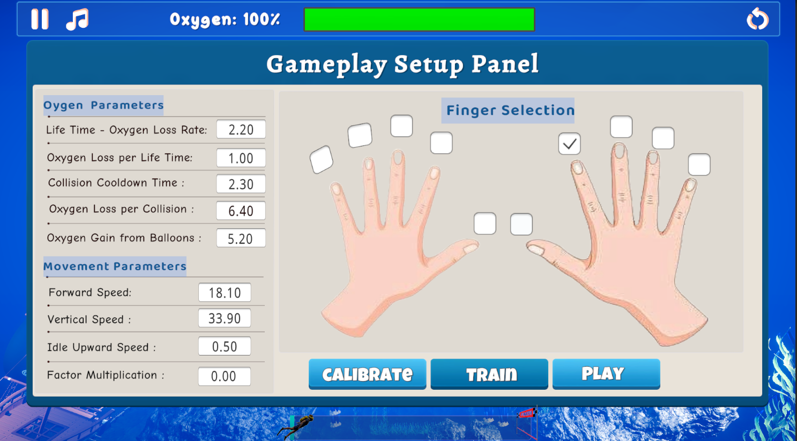
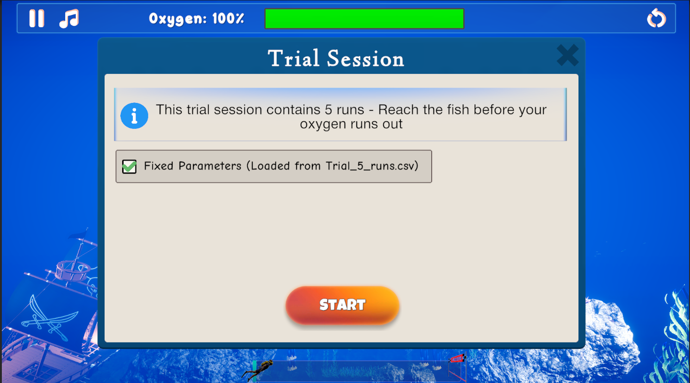
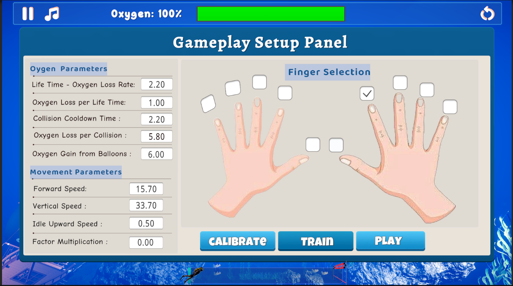

# Aqua Guardian

## Overview

**Aqua Guardian** is an innovative rehabilitation game designed to aid stroke patients in regaining hand and finger mobility. The game integrates with the Amadeo device, allowing patients to control an underwater diver who must navigate a series of caves and obstacles. The game is both engaging and therapeutic, providing real-time feedback and adjustable difficulty levels tailored to each patient's needs.

## Table of Contents

1. [Problem Statement](#problem-statement)
2. [Objectives and Methodology](#objectives-and-methodology)
3. [Gameplay Mechanics](#gameplay-mechanics)
4. [Instructions](#Instructions)
5. [Evaluation and Results](#evaluation-and-results)
6. [Enhanced Version: Adaptive Difficulty System](#enhanced-version-adaptive-difficulty-system) ⭐ **NEW**
7. [Additional Documentation](#additional-documentation)

## Problem Statement

Stroke patients often experience significant challenges in regaining hand and finger mobility. Traditional rehabilitation exercises are repetitive and can lead to low motivation and engagement. Existing rehabilitative games do not fully address these issues, resulting in poor patient adherence. **Aqua Guardian** seeks to enhance patient engagement through a more immersive and motivating experience.

## Objectives and Methodology

### Project Objectives

1. **Enhanced Engagement:** Create a more engaging game experience to motivate patients in their rehabilitation exercises.
2. **Customizable Difficulty:** Implement adaptive difficulty levels that align with each patient’s abilities.
3. **Targeted Rehabilitation:** Focus on specific finger movements to promote better overall hand functionality.

### Methodology

- **Data Integration:** The game reads real-time force data from the Amadeo device, which the patient uses to control the diver's movements.
- **Customization:** Game parameters such as the size and difficulty of caves, diver speed, and oxygen depletion are adjustable to match patient needs.
- **Visual and Audio Feedback:** Immediate feedback is provided to the patient through visual effects and sound cues, enhancing the therapeutic experience.

## Gameplay Mechanics

In **Aqua Guardian**, the patient controls a diver navigating through underwater caves. The diver must avoid obstacles, collect oxygen balloons, and reach the treasure chest before running out of oxygen. The game adjusts its difficulty based on the patient's performance, ensuring an appropriate level of challenge.

### Key Features

- **Dynamic Environment:** The game environment is visually engaging, with realistic ocean visuals and animated diver movements.
- **Progress Tracking:** A progress bar keeps the patient informed of their current status and the distance remaining to the goal.
- **Feedback Systems:** Both visual (e.g., screen effects for collisions) and audio cues (e.g., impact sounds) are used to guide and motivate the patient.

## Instructions

To play **Aqua Guardian**, connect the Amadeo device to your system, and follow these steps:

1. **Configure Game Parameters:** Adjust the difficulty settings, select the finger for training, set other preferences using the GUI, and modify the cave settings via the provided Excel file.

   

   

2. **Start the Game:** Begin the session and navigate the diver through the cave's obstacle course using the Amadeo device. Be aware, oxygen levels decrease over time, as defined in the settings screen (Section 1).

   

3. **Monitor Progress:** Track your progress via the in-game feedback systems, including visual and audio cues.

4. **Damage/Healing System:** Take care to avoid damaging the caves, as each collision reduces your oxygen supply and spills blood. To gain oxygen, need collecting the balloons placed strategically throughout the course.

   

   

5. **Complete the Course:** Get to the treasure before you run out of oxygen.

   

## Evaluation and Results

### Experimentation

The game was evaluated through trials with patients at the Beit Loewenstein Rehabilitation Center. Patients were connected to the Amadeo device and played **Aqua Guardian** after their functional levels were assessed. The game's difficulty was adjusted based on each patient's abilities.

### Feedback

- **Patient Engagement:** Patients reported higher levels of engagement and motivation compared to existing rehabilitative games.
- **Positive Outcomes:** The immersive and enjoyable nature of the game led to longer play sessions, which are crucial for effective rehabilitation.

**Aqua Guardian** has demonstrated its potential as a valuable tool in stroke rehabilitation. The game not only provides therapeutic benefits but also makes the rehabilitation process more enjoyable for patients.

---

## Enhanced Version: Adaptive Difficulty System

⭐ **NEW**: This version introduces a **comprehensive adaptive difficulty system** with significant improvements and new features.

### What's New

**Intelligent Difficulty Calibration:**
- Patient-specific machine learning models (Ridge regression)
- Automatic parameter optimization for 9 difficulty levels (10%-90% oxygen targets)
- Three-phase optimization cascade for robust solutions

**User Interface Enhancements:**
- Pause button for patient breaks
- Mute button for audio control
- Enhanced visual feedback systems

**Code Architecture Improvements:**
- Centralized configuration via `GameDataSO` ScriptableObject
- Modular system architecture (ML, Regression, Trial System modules)
- Improved code organization and maintainability

**Bug Fixes & Reliability:**
- Fixed movement calculations in `PlayerMovement.cs`
- Improved collision detection and Amadeo device integration
- Automatic data persistence and CSV export

**Data Management:**
- Automatic trial result export to structured CSV files
- Dynamic column support for multiple run attempts
- JSON-based parameter selection and loading

### Screenshots

.png)
.png)

.png) .png)

After selecting parameters:

---

## Project Structure

| File | Description |
|------|-------------|
| **GameDataSO.cs** | ScriptableObject for centralized game configuration (max health, speeds, collision delays) |
| **GameStateManager.cs** | Manages global game state (panel open/closed, trials active, game events) |
| **PlayerMovement.cs** | Controls diver movement (horizontal/vertical speed, idle upward drift, Amadeo/keyboard input) |
| **PlayerLife.cs** | Manages collision damage, healing from oxygen balloons, blood splatter visual effects |
| **PlayerIntro.cs** | Handles "Get Ready... Go!" countdown sequence at game start |
| **Health.cs** | Tracks oxygen level, depletion over time, game over conditions |
| **AmadeoClient.cs** | Manages connection to Amadeo device, input mode switching (PC/Amadeo/Emulation) |
| **getEventFromAmadeoClientDiver.cs** | Processes force data from Amadeo device and converts to movement commands |
| **TrialSystemManager.cs** | Orchestrates trial sessions (5 runs), tracks results, manages trial flow |
| **TrialParameterManager.cs** | Loads/applies trial parameters from CSV, generates random parameters if needed |
| **TrialDataService.cs** | CSV reading/writing service, parameter persistence |
| **TrialDataModels.cs** | Data structures for trial parameters (speed, oxygen drain, collision damage, etc.) |
| **TrialUIController.cs** | Manages trial control panel UI (start next, retry, exit) |
| **TrialFishSpawner.cs** | Spawns target fish at end of trial caves |
| **GameSystemResetter.cs** | Resets player position, health, spawned objects between trials |
| **CsvFileHelper.cs** | Utility for CSV file operations |
| **CoroutineHost.cs** | Persistent GameObject for running coroutines across scenes |
| **DifficultyParameterSolver.cs** | **Core ML system** - 3-phase optimization cascade for difficulty calibration |
| **MultipleLinearRegression.cs** | Ridge regression implementation for parameter-to-oxygen prediction |
| **MultiTargetOptimizer.cs** | Optimizes parameters for 9 target oxygen levels simultaneously |
| **OxygenPredictor.cs** | Predicts final oxygen based on game parameters |
| **RegressionExtensions.cs** | Matrix operations and math utilities |
| **RegressionMath.cs** | Statistical functions for regression |
| **FeatureExtractor.cs** | Extracts 10 features from trial parameters (including derived EffectiveDrainRate) |
| **FeatureNormalizer.cs** | Standardizes features for ML models (z-score normalization) |
| **ParameterHelper.cs** | Parameter validation and range management |
| **RegressionMetrics.cs** | Model evaluation metrics (R², RMSE, MAE) |
| **OxygenCalculationSettings.cs** | Configuration for oxygen prediction |
| **PythonRegressionHandler.cs** | Interface for Python-based ML models |
| **PythonRegressionModel.cs** | Communication with Python regression server |
| **PythonRegressionServerClient.cs** | HTTP client for Python ML server |
| **PanelOpenUp.cs** | **Main game controller** - manages panel open/close, cave building, parameter application |
| **LevelProgressUI.cs** | Progress bar showing distance to goal |
| **PauseManager.cs** | Pause menu functionality |
| **TrialRegressionUI.cs** | Multi-target analysis UI - table with 9 difficulty levels, model selection |
| **TrialReportGenerator.cs** | Generates detailed trial reports and statistics |
| **GoToEndGame.cs** | Handles end-game scene transition or trial completion |
| **ScenesManager.cs** | Scene loading utilities |
| **ArrowUpDown.cs** | Animated arrow indicators |
| **MuteController.cs** | Audio mute/unmute functionality |
| **RotateObject.cs** | Object rotation animation |
| **FindMissingScripts.cs, MissingScriptsScanner.cs, PrefabMissingScriptsFixer.cs** | Development utilities for cleaning up broken references |
| **CaveBuilder.cs** | Procedurally builds caves from CSV specifications (diameter, height, length) |
| **SelectedParametersService.cs** | Saves/loads user-selected parameters from multi-target analysis to JSON |
| **TrialDataCache.cs** | In-memory cache for trial data during sessions |
| **RegressionUtilities.cs** | General utilities for regression system |
| **TrialRegressionAlgorithm.cs** | Regression algorithm wrapper |

## Key File Relationships

### Game Flow
1. **PanelOpenUp.cs** → Main entry point, orchestrates everything
2. **CaveBuilder.cs** → Builds environment from CSV
3. **PlayerMovement.cs** + **Health.cs** + **PlayerLife.cs** → Core gameplay loop
4. **GameStateManager.cs** → Coordinates state across all systems

### Trial System Flow
1. **TrialSystemManager.cs** → Manages 5-trial sessions
2. **TrialParameterManager.cs** → Loads parameters from CSV
3. **GameSystemResetter.cs** → Resets between trials
4. **TrialDataService.cs** → Saves results to CSV

### ML/Regression Flow
1. **TrialRegressionUI.cs** → User interface
2. **DifficultyParameterSolver.cs** → Core optimization (3 phases)
3. **MultipleLinearRegression.cs** → Ridge regression model
4. **FeatureExtractor.cs** → Prepares data
5. **MultiTargetOptimizer.cs** → Generates 9 difficulty levels
6. **SelectedParametersService.cs** → Saves user selection

---

## Additional Documentation

📖 **For the Original Version:**
- See [AquaGuardian_FinalProjectBook.pdf](AquaGuardian_FinalProjectBook.pdf)

📖 **For This Version (Adaptive Difficulty System):**
- See **[PROJECT_OVERVIEW.md](PROJECT_OVERVIEW.md)** - Complete technical documentation
